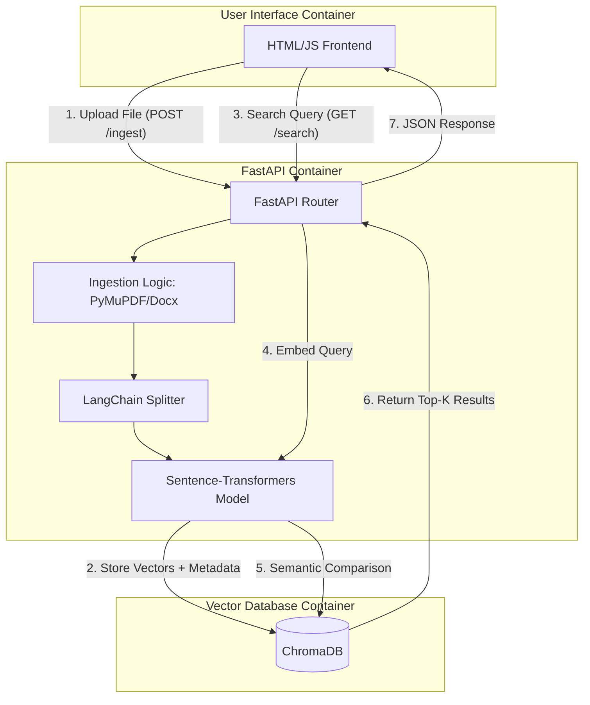

# semantix
A portable semantic search tool for comprehending your local markdown, docx, and pdf files.

###
Languages and Tools:
- Python
- FastAPI
- Docker
- ChromaDB

### Architecture Diagram

```mermaid
graph TD
    subgraph Client_Side [User Interface Container]
        UI[HTML/JS Frontend]
    end

    subgraph Backend_API [FastAPI Container]
        API[FastAPI Router]
        Ingestor[Ingestion Logic: PyMuPDF/Docx]
        Splitter[LangChain Splitter]
        Embedder[Sentence-Transformers Model]
    end

    subgraph Storage_Layer [Vector Database Container]
        DB[(ChromaDB)]
    end

    UI -- "1. Upload File (POST /ingest)" --> API
    API --> Ingestor --> Splitter --> Embedder
    Embedder -- "2. Store Vectors + Metadata" --> DB

    UI -- "3. Search Query (GET /search)" --> API
    API -- "4. Embed Query" --> Embedder
    Embedder -- "5. Semantic Comparison" --> DB
    DB -- "6. Return Top-K Results" --> API
    API -- "7. JSON Response" --> UI
```

