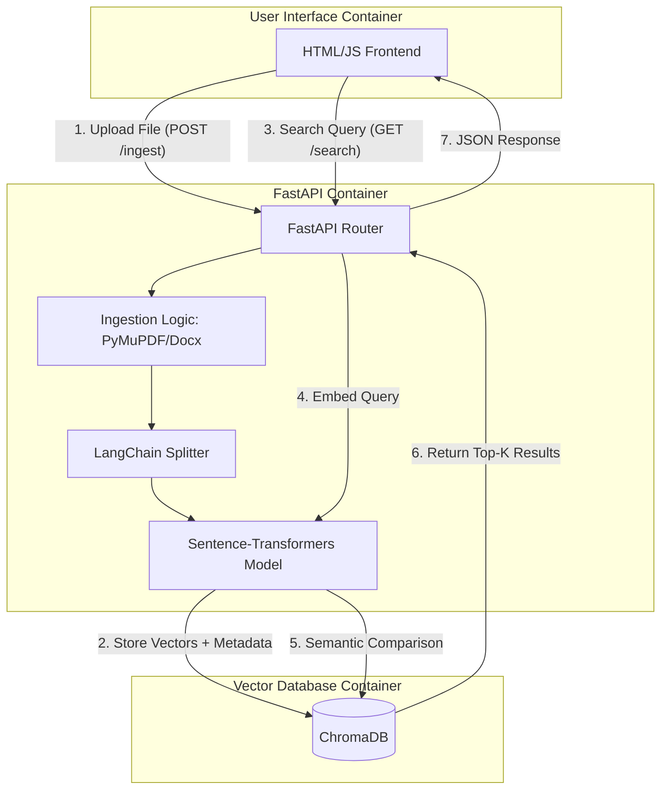

# semantix
A portable semantic search tool for comprehending local markdown, docx, and pdf files.

###
Languages and Tools:
- Python
- FastAPI
- Docker
- ChromaDB
- LangChain
- HTML
- CSS
- Javascript
- Transformers (HuggingFace)

### Architecture Diagram



## Installation
To build this application you simply need to clone this repo locally or you can run 
`curl github.com/eonloop/semantix`

This container comes bundled as a docker compose package, so once you've downloaded the repo run the following commands

```bash
cd semantix
docker compose up --build
```

## Usage:
Once the application is up and running You can then access the application from 

`localhost:8000`

Here you will be able to upload individual documents once you've uploaded the documents there is no current ability to clear the database, this will be coming in a future improvement.

Once you have uploaded your documentation you should be able to query it by typing you query into the "Enter a search query" text field and clicking search.

This should return the top 2 results from your documentation that you have uploaded into the database.

